import Feedback from "@theme/Feedback";

Most software engineers use a tool called Git to organise their code, and collaborate with other people.

Git is a version control tool, used to keep the history of changes, and makes collaboration easier. We'll see many of its uses throughout the course.

Each week, you're going to use Git to get a copy of your homework exercises, to submit your solutions, and to get feedback on your solutions. Today, you're going to learn how to do these things.

## Learning Objectives

By the end of this class, you should be able to:

- Explain why Git is a useful tool.
- Get a copy of your homework questions onto your computer.
  - (To _clone_ a repository).
- Save your answers, and send them to our volunteers.
  - (To _commit_, _fork_ a repository, and _push_ changes).
- See and respond to feedback on your homework.
  - (To use GitHub's _pull request_ workflows, and _push_ further changes).
- Explore how a file has changed over time.
  - (To use Git's _history log_).

---

## Before you start

Before you arrive at class you **must** have completed the following setup work.

[Git Preparation](../preparation)

_If you are a teacher reading this, please check the [Instructor Notes](./instructors)_

## What problem does Git solve?

Git is a version control tool, used to keep the history of changes, and make collaboration easier. It's used to solve many problems, but today we're going to focus on how it:

- Helps us to share information.
- Enables people to make their own changes to that information, and share it back.
- Allows us to make checkpoints so that we can save our work as we go along.
- Allows us to track how information has changed between each checkpoint, and go back to older versions of our work if we want to see what we tried before, or to undo changes.
- Enables us to try more things, because if they didn't work out, we can always go back to what we had working before, by going back to a checkpoint.

### Versioning

We use Git to track different versions of files.

Perhaps you've had this experience before...

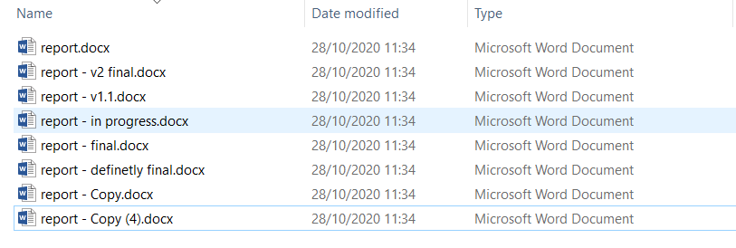

You've probably in the past saved a document in a file with "draft" in its name, and then another with "version 1" in its name, and eventually one called "final", and then "really final", and then "final after feedback". It can be hard to know what the latest one is, and to track what order the files came in. But we keep these files around, because they were useful, and we may want to check something from them.

Git helps us to avoid this problem. Before we see how Git helps, let's try an exercise:

### Exercise 1 (10 minutes)

Open these three links - they are different stages of a draft blog post about CodeYourFuture:

- [final](https://CodeYourFuture.github.io/git-draft-blog-post-example/final)
- [revised](https://CodeYourFuture.github.io/git-draft-blog-post-example/revised)
- [v1](https://CodeYourFuture.github.io/git-draft-blog-post-example/v1)

Try to find all of the differences between these three documents. Can you work out which one is the finished one which was meant to go on the website?

You probably found it hard to see all of the differences (some were really small, like adding or removing a comma!), and non-obvious which is the most complete version!

## How does Git help?

Imagine your teacher wanted everyone in the class to answer three questions and to send back the answers. What capabilities would we need in order to be able to do that?

**First**, the teacher needs to be able to write the questions, and **store** them somewhere.

When we're using Git, we write things down in files in a folder (these could be text files, Word documents, images, or really any kind of file). When we save these files, we say we're _committing_ them, and we call the folder where we're saving them a _repository_ (or _repo_ for short).

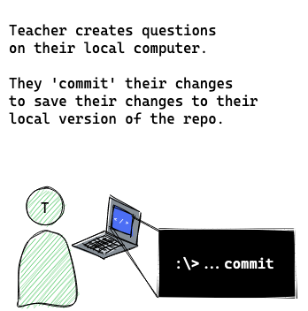

**Next**, the teacher needs to put the repository somewhere where the learners can get it. We call this _pushing_ the repository. The teacher won't send a copy to each learner, but will put one copy somewhere on the Internet, and tell the learners where it is. The place the teachers on this course will be pushing to is a website called [GitHub](https://github.com), but there are other websites they could push to if they wanted to. This is the difference between Git and GitHub - Git is a way of storing and sharing files, and GitHub is one website where you can use Git.

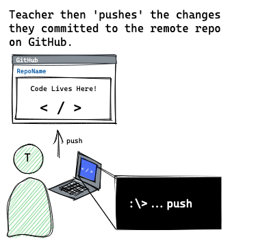

**Then**, now that the teacher has pushed the questions, each learner needs to be able to **get the questions onto their computer**.

When we're using Git, we call this _cloning_ the teacher's repository (because we're making our own copy). After we've cloned the repository, we will have the same folder on our computer as the teacher created, committed, and pushed.

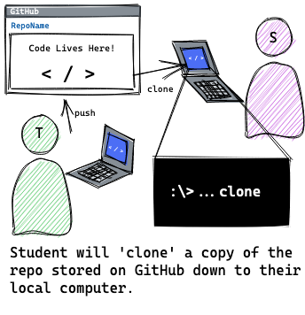

## The Git Cheatsheet

We tend to do the same four or five things in Git over and over again, but it can be easy to forget them. There's a handy reference at [Git Cheatsheet](./cheatsheet) to help you remember.

Let's walk through one of the sections together: "I want to get code from a repo onto my computer (Cloning)". It has a video, to show us what we should be doing, and explains each step in the text.

We'll use it in our next exercise:

### Exercise 2 (15 minutes)

Volunteers from Code Your Future have already pushed an example repository, so you're going to try to clone it from GitHub onto your computer.

Try following the instructions labelled "I want to get code from a repo onto my computer (Cloning)" from the [Git Cheatsheet](./cheatsheet). The repository we want to clone is `https://github.com/CodeYourFuture/cyf-demo-repo`.

When you've finished the exercise, you should have `file.txt` open in VS Code.

## What did we just do?

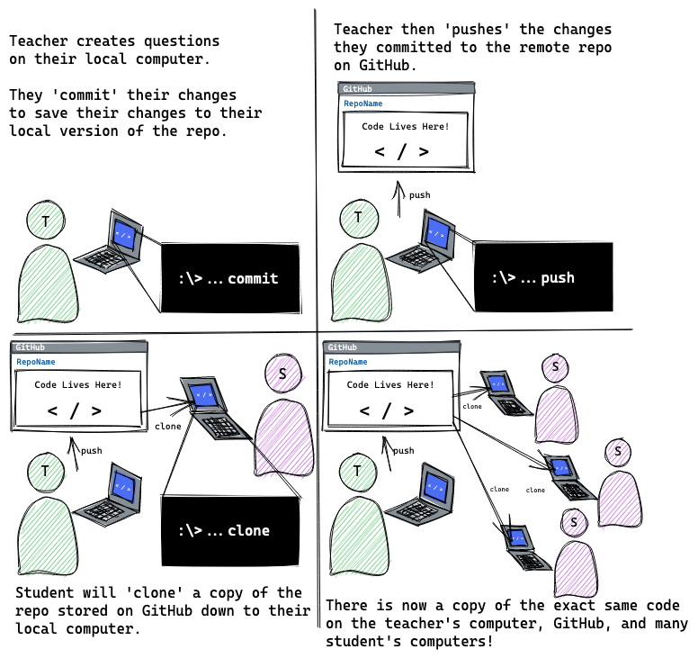

Each of you just cloned a repository which CodeYourFuture created onto your computer, and opened up your copy of one of the files. This is the process you're going to follow to get your homework every week.

## Let's do some homework (teacher-led demo)

The file you opened, `file.txt`, has a question in it. We're going to answer the question, and submit it as if it was our homework.

Let's clone our repository to our computer:

```
https://github.com/CodeYourFuture/cyf-demo-repo
```

We can edit the file in VS Code to answer the question, and save it like normal.

After we've saved the file, if we open up GitHub Desktop, something interesting has changed. On the left, it now says "1 changed file", and on the right, it shows us what the change was. Things we've removed get a red background, and things we've added get a green background.

(If you've changed a line, the old version will appear with a red background, and the new version with a green background).

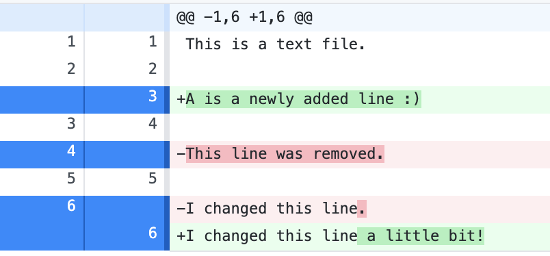

This is a really useful way for us to check over our homework before submitting it. If we've accidentally deleted things, or changed things we didn't mean to, we can notice now, and un-do them by editing the file again.

When we're happy with our change, we can press the "Commit to main" button. That tells Git "This change is an interesting change, I want to keep it". You don't need to wait until you've got your answers perfect before committing, in fact it's better to make lots of commits as you work - we'll come back to this in a bit!

This doesn't copy our change to any other computer - it won't go on GitHub - commiting is something we just do on our computer.

### Exercise 3 (10 minutes)

Try doing what your teacher just did:

1. Answer the question in `file.txt` in VS Code and save your changes.
2. Look at the diff in GitHub desktop - does it look as you expect?
3. Make a commit in your local repository.

### Teacher-led demo continues...

Now, because we committed a change, our copy of the repository is different from CodeYourFuture's copy. GitHub Desktop now gives us a new button: "Push origin" ("origin" is what Git calls "where I cloned this repository from"). If we press it, it will try to send our change to the CodeYourFuture version.

We didn't have this button before, because even though we had changed the files, we hadn't committed any changes. There's an important distinction here: When we save files in VS Code, we store them in the file on our computer, but Git doesn't automatically commit them. It notices the changes (it showed them to us!), and asks us if we want to commit them. Only after we've committed them does it let us push them. We'll talk about when you want to commit later on today.

So, we're happy with our homework, we've committed it, let's try pushing it!

## Forking

GitHub Desktop just gave us a really useful warning, but it uses some words we haven't seen yet!

We just tried to push our changes to CodeYourFuture's copy of this repository. But we're not allowed to do that! Imagine if anyone could just push anything they wanted to our repository! Someone could accidentally delete all of the questions, or add the answers to all of the questions, or turn the HTML homework into a bunch of questions about vegetables!

To avoid this, we use something called a _fork_ and something called a _pull request_.

Remember when we cloned the repo, we pasted `https://github.com/CodeYourFuture/cyf-demo-repo` in as the place to clone from? Let's look at that:


This is saying "On GitHub, the user `CodeYourFuture` has a repository called `cyf-demo-repo`, I want that".

GitHub lets you host your own copy of the repository on GitHub too! If your username is `EagerLearner`, can you guess what URL your repository would be at?

That's right, https://github.com/EagerLearner/cyf-demo-repo!


This is called a _fork_. It's a copy of the repository, where you're allowed to make changes. So when GitHub Desktop just asked us "Do you want to fork this repository?", what it's really saying is "You're not allowed to make changes to CodeYourFuture's repository, would you like to make your own copy on GitHub where you _are_ allowed to make changes, and put your changes there?"

That sounds like exactly what we want to do, so we'll click the "Fork This Repository" button.

Then GitHub asks us whether we want to fork "To contribute to the parent project" (i.e. because we want to work with CodeYourFuture) or "For my own purposes" (i.e. because we want to do our own thing apart from CodeYourFuture). We want to work with CodeYourFuture, so we'll select "To contribute to the parent project" and press Continue.

Now if we press "Push origin", it will copy our changes to our fork on GitHub.

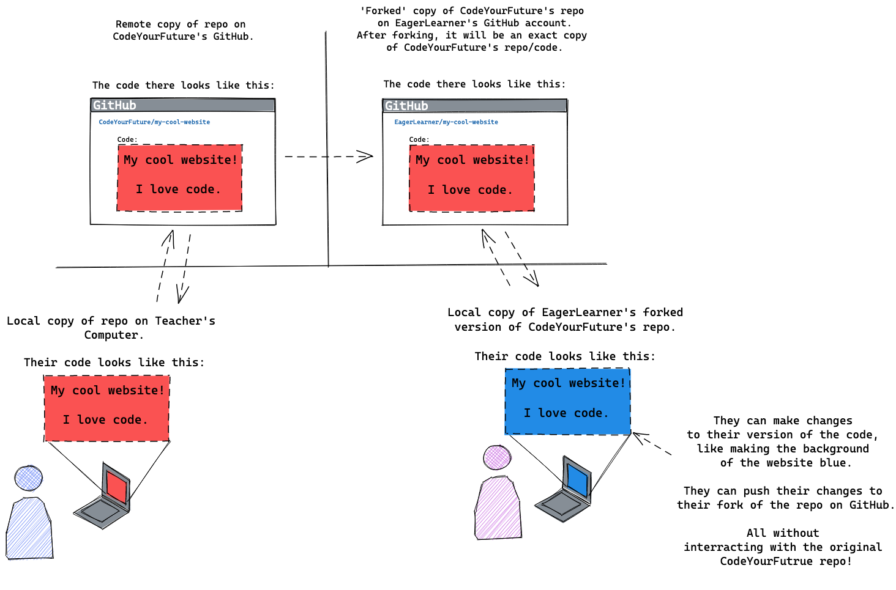

If you forget this, it's in the [cheatsheet](./cheatsheet)! Check out the "I want to send my code to volunteers (Pushing)" section.

## Making a Pull Request

Now that we've pushed our homework to our fork, we need to tell CodeYourFuture about it, so that the volunteers know to look at it!

We do this with something called a _pull request_. This is a slightly weird name, in the context of homework.

Normally, when people push changes to a fork on GitHub, they're doing so because they want the person who owns the repository to look at the changes, and pull the changes into their repository. For example, this webpage we're reading the syllabus on right now is hosted on GitHub, and if someone spots a typo, they can fix it, push it to their fork, and request for CodeYourFuture to pull their change into CodeYourFuture's version (hence the name a pull request - "requesting to pull in changes").

We call pulling someone's change into a repository "merging" the change, because we're merging what we're pulling into our repo with what we had before.

For submitting homework, every week you're going to create a pull request, and a volunteer will look at it and give you feedback, but we won't be pulling your homework into CodeYourFuture's copy (then the next trainee would have the answers when they tried to read the questions!). You'll be creating pull requests, but we won't actually merge your changes into the repository.

In GitHub Desktop, if you open the Branch menu, and click "Create Pull Request", it will open your web browser at GitHub, and show you the changes you're about to make a pull request for. This is another great time to check that you're happy with your homework (if you're not, go back to VS Code, make your changes, commit them, push them to origin again, and refresh this page).

If you're happy, press the "Create pull request" button. Fill in the details in the form, so that the volunteers know what they're meant to be reviewing, and press "Create pull request".

Now there's a pull request that volunteers can look at! They can see who made the pull request, and see all the changes you've made.

### Exercise 4 (15 minutes)

Make yourself a pull request with your change!

1. Try to push your changes, make a fork, and then actually push your changes.
2. Make your first pull request!

If you get stuck, check out the [cheatsheet](./cheatsheet) :)

### Exercise 5 (5 minutes)

There's another file in the repository you've cloned, `other-file.txt`.

1. Open it
2. Answer the question in the file
3. Commit
4. and Push

Notice a couple of things are different this time!

It didn't ask you to fork the repository - that's because you already have a fork you're allowed to push to.

You may also notice that if you click the "Create Pull Request" menu item, it brings you to a different page. It doesn't have a "Create Pull Request" button, it has a "View Pull Request" button. This is because if you already have a pull request open, when you push more changes, it will update your existing pull request.

This is useful for responding to feedback you get on your homework. There are ways to open more than one pull request at a time (using something called branches), which we'll learn about in the future, but for now, one should do!

## Getting feedback

When you've made your pull request, our volunteers will be notified. They will look at your changes. When they are done, you will get an email. Here are some of the things they may do:

- Make comments with suggestions, either about a particular bit of code, or about the whole pull request.
- Add labels to the pull request (e.g. marking it as complete, or unfinished).

If they give you suggestions, you should try to implement the suggestions, and push a new commit. If you're confused, struggling, or find them unclear, you can respond to the comment with a comment of your own, or ask on Slack.

## History

One useful features of Git is how it stores your commits. Each time you commit, Git adds your new commit to a chain of commits, one after the other.

You can imagine that each commit points at the commit before, and then adds its own changes on top. Maybe this is what we cloned from GitHub:

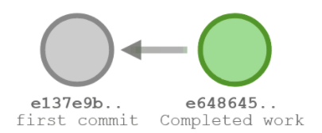

Then when we commit locally, we add new commits to the end of the chain:


Until we push, GitHub and our computer will have different chains of history - the local history will be the same as the remote history, but with extra commits at the end:

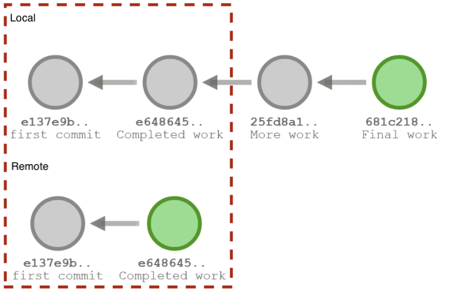

And then after we push, the extra commits are added to GitHub's history, and the chains will look the same:

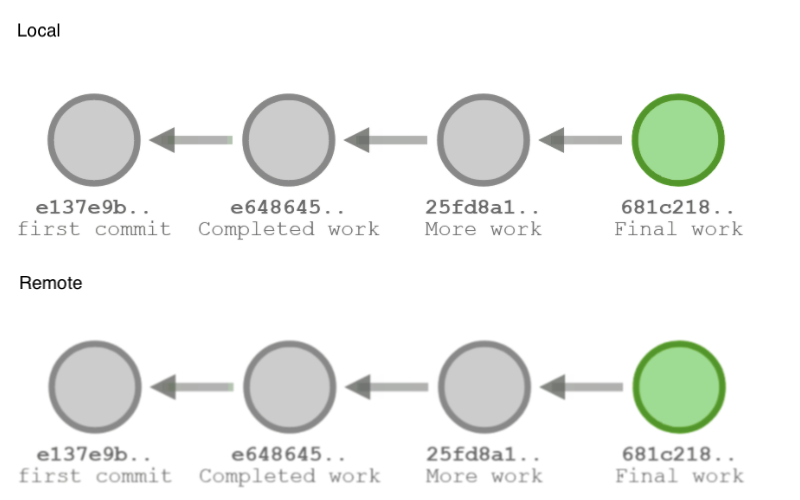

### Exploring history

In GitHub Desktop, if you open the History tab, you can see a list of each commit that's been made in the repository, with the oldest at the bottom and the newest at the top.

If you click on one of the commits, you'll see the changes that happened in it. This can be really useful to understand how the repository evolved to how it looks today. It can also help us to find out when bugs were introduced!

You can always see an old version of a file by looking in the Git history, and if you want to get it back, you can just copy and paste it from the history view into your text editor.

### When to commit, push, and make a pull request

You should commit often! Every time you think you've done something you may want to look at again, you should make a commit.

Let's say you've made a website, and it generally looks about right, but you were thinking of adding some colour, or an animation. Before you do that, make a commit, because then if you break some of the CSS by trying to add an animation, you can always undo it.

Or if you want to try out a few different colours, make a commit for each colour, and then you can easily see what colours you tried out, and compare them.

#### Teacher-led demo: Changing the colours

A volunteer made a small website, which we can find in https://github.com/CodeYourFuture/SampleGitWebsite

They had a few different colour combinations they were trying to choose between. Because they made commits for each choice, we can look at their choices, and try them each out.

If they hadn't made all of those commits, they probably would've forgotten at least one of the colours, and we wouldn't be able to see them now. Maybe they would've lost the perfect colour! Thankfully, we can look in the git history and see each step along the way.

Similarly, you don't need to have finished everything before you push - in fact, it can be better to push lots! If your computer crashes, or you accidentally delete your files, or you want to work on homework on someone else's computer, you can always get back anything that you've pushed to GitHub. So commit often, and push often!

You also don't need to have finished all of your homework in order to make a pull request! If you've been struggling with one question, you can make a pull request and ask for help (you can even link to it on Slack! It will help the volunteers to help you, because they will be able to see exactly the code you're struggling with). Or if you've done most of the homework, but are struggling with a few questions, a volunteer can look at what you've done and help you out - but only if they can see your code!

Commit often, push often, and make pull requests early!

You may notice that your commits all have messages like "Update file.txt", whereas the ones before you started editing have different messages.

Commit messages can be really useful to understand what a change did without having to read the whole thing. Let's try out an exercise to help us understand this:

### Exercise 6 (10 minutes)

1. Clone https://github.com/CodeYourFuture/git-log-example (if you forgot how, check the [cheatsheet](./cheatsheet)
2. Have a read of the file called `README.md`. See if you can find a problem in the file.
3. Look through the history in GitHub Desktop. See if you can work out when and why the problem was introduced.
4. Make a pull request fixing the problem.

### Exercise 7 (5 minutes)

Remember earlier we looked at three blog posts? They're actually in a repository on GitHub! https://github.com/CodeYourFuture/git-draft-blog-post-example

Clone the repository and take a look. Can you find all of the differences between them now? Can you tell which was the finished version? How much easier/harder is this than it was without Git?

## Commit messages

If you looked through the history of the Git repository, you may have been able to see where the problem came in just from the commit message, without having to look at the changes that were actually made. If the commit messages were all just "Update file.txt", that would've been much harder!

When we make commits in Git, we try to give clear, helpful messages, describing what changed, and why. (The why is really important! You can always work out _what_ changed by reading the change itself, but it's much harder to work out _why_ if no one wrote it down!)

There is a convention when using Git to use the following format for commit messages:

```
One sentence summary

Longer explanation of how, the reasons, exceptions, or anything that may be surprising.
This may be many sentences, and keep going for a long time.
```

Try to use this format when making your own commits. GitHub Desktop tries to encourage this by having two boxes above the "Commit to main" button - one which is just one line, and one where you can put lots of lines.

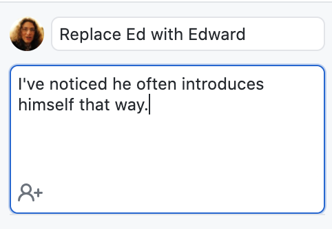

Explaining _why_ we're making the change can help people in the future to understand why things look the way they do, and what's important not to change.


## Using technical language as a developer

In this section we'll explore how a professional uses technical language to communicate and deliver a tutorial based on what you have learned so far to three different audiences. 

:::note Exercise (20 minutes)

It's time to train the trainer and practice your communication skills, your task is to pick an audience and deliver a short tutorial on:

1) Why Git is a useful tool?
2) How to  commit, fork a repository, and push changes?

In small groups you must pick an audience from this list:

1) A group of 10 year olds
2) Your boss
3) a peer group at a similar level to you

:::

:::note Exercise (40 minutes) 

You have a maximum of three minutes to present back to the wider group.

::: 

## Coursework going forwards

For the next four modules, most weeks your homework is going to be to clone a repository from GitHub, write some code, and make a Pull Request with the code.

## Glossary

We introduced a few new things in this class, and it can be a bit confusing to know which is which:

- **Git** is a system for storing changes to files in commits, and sharing them between different computers. There are also other systems which do this, but Git is the most popular one.
- **GitHub** is a website which will store a copy of your Git repository, and allow you to clone it, and push changes to it. There are also other websites which can do this, but GitHub is the most popular one.
- **GitHub Desktop** is a program made by GitHub to allow you to use Git easily from your computer. Later in the course, we will use other programs to use Git, too.

## Coursework

You can find this weeks homework [here](./homework)

## Feedback

It's really helpful if you give us feedback for this lesson. This helps us improve it for future trainees!

<Feedback module="Git" week="Week 1" />
